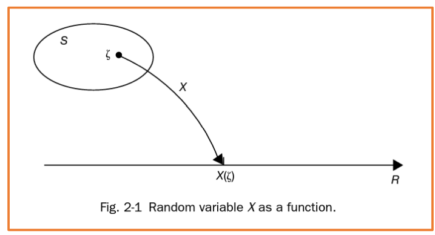

# Contents
* Random Variables
* Independence
* Expectations
* Correlation & Covariance
* Guassian Distribution

## Random Variables
* Random Variable (확률 변수)
  * 각 `sample point`를 `실수`로 할당해주는 **함수**다.
  * **결론: sample point를 숫자로 바꿔서 처리해주는 것**

$$
S = {H,T} \text{이렇게 숫자가 아닌 sample point를 실수로 표현해주는 함수}

X=
\begin{cases} 
0 & (H) \\
1 & (T)
\end{cases}
$$

k
